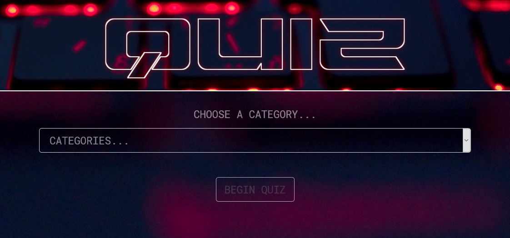
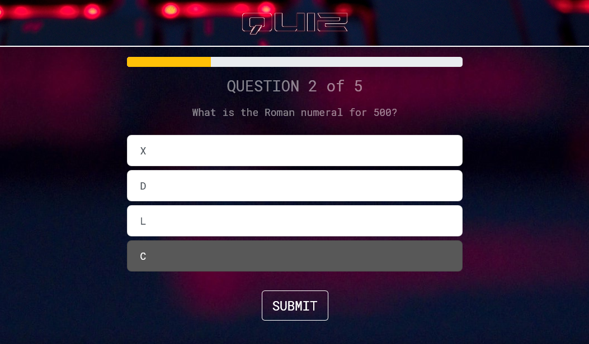

# Quiz
> A simple, short, fun, multiple-choice quiz!

## Table of contents
* [Description](#description)
* [Features](#features)
* [How To Use](#how-to-use)
* [Screenshots](#screenshots)
* [Built With](#built-with)
* [Contact](#contact)

## Description
**Quiz** is a simple web quiz where you choose a category and then answer 5 multiple-choice questions, revealing your score at the end.

It queries an API database ([Open Trivia DB](https://opentdb.com/)) of trivia questions in your chosen category to retrieve the questions and answers.

## Features
* choose a category for each round
* answers display green if correct and red if incorrect
* result is displayed at the end of the 5 questions

## How To Use
1. Choose a category from the dropdown list and click "BEGIN QUIZ"
2. Choose an answer and click "SUBMIT"
3. Click "NEXT QUESTION" 
4. Repeat steps 2-3 until you reach question 5
5. Click "GO TO RESULTS"
6. Click "NEW QUIZ" and start again from step 1

## Screenshots

## Built With
* HTML
* CSS
* JavaScript
* Bootstrap - 4.3.1
* React - 16.10.1
* Redux - 4.0.4
* Node - 10.16.0
* npm - 6.9.0

## Contact
Created by Guy Owen - guy.owen@virginmedia.com